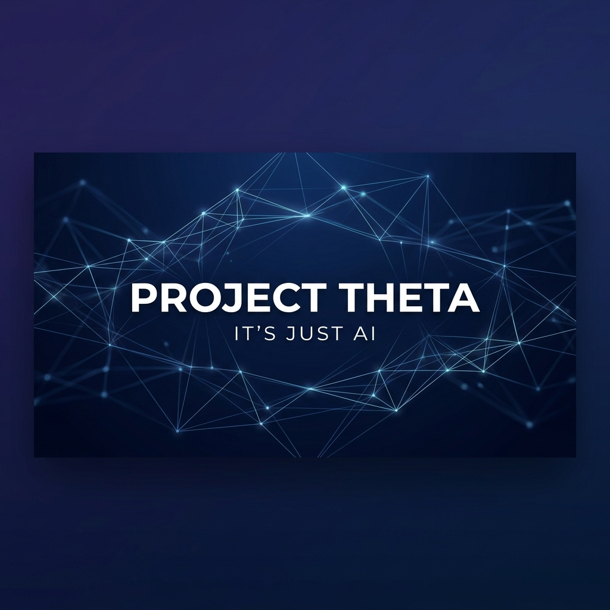

 

# 🔵 PROJECT THETA

### *Democratizing AI. One Lesson at a Time.*

**The open-source syllabus for the AI revolution. Radical access. Zero gatekeeping.**

 

 

---

## 🧭 The Vision
Society is splitting. On one side are the AI-literate, scaling their potential. On the other are those left behind by fear or gatekeeping. **Project Theta exists to bridge that gap.**

We don't just show you how to use tools; we show you how they work. From the simplest prompt to the deepest transformer architecture.

---

## 🚀 Explore the Hub

<table align="center">
  <tr>
    <td align="center" width="33%">
      <a href="./syllabi/beginner-path.md">
        <h3>🟢 Start Learning</h3>
      </a>
      
Zero experience? Start here. A step-by-step path to AI literacy.

    </td>
    <td align="center" width="33%">
      <a href="./resources/tools.md">
        <h3>🛠️ Tool Library</h3>
      </a>
      
Curated list of Text, Image, Audio, and Video AI tools for every use case.

    </td>
    <td align="center" width="33%">
      <a href="./resources/foundation.md">
        <h3>🧬 Deep AI</h3>
      </a>
      
Go beyond the surface. Research papers, math, and architecture.

    </td>
  </tr>
  <tr>
    <td align="center" width="33%">
      <a href="./prompts/master-guide.md">
        <h3>✍️ Master Prompts</h3>
      </a>
      
The art of communication. Learn how to get exactly what you want from AI.

    </td>
    <td align="center" width="33%">
      <a href="./docs/glossary.md">
        <h3>📖 Glossary</h3>
      </a>
      
No jargon. Just plain English explanations for complex AI terms.

    </td>
    <td align="center" width="33%">
      <a href="./videos/how-to-submit.md">
        <h3>🎬 YouTube</h3>
      </a>
      
Contribute to our visual classroom and learn from the community.

    </td>
  </tr>
</table>

---

## 💡 The Philosophy: "It's Just AI."
We believe AI should be demystified. It's not magic; it's math and data. By normalizing it, we make it accessible.

> [!IMPORTANT]
> **This initiative is strictly Non-Profit.**
> The associated YouTube channel is unmonetized. No ads, no paywalls, no "AI Guru" course. Just education.

---

## 🤝 Community & Contributions
Project Theta is decentralized. We rely on your knowledge to stay current.

- **Found a new tool?** [Open a Suggestion](https://github.com/RishiR123/project-theta/issues/new?template=resource_suggestion.yml)
- **Want to teach?** [Submit a Video](./videos/how-to-submit.md)
- **Have a question?** [Join the Discussion](https://github.com/RishiR123/project-theta/discussions)

---

### 🌟 Our Backbone: The Contributors

 

**Project Theta — It's Just AI.**

